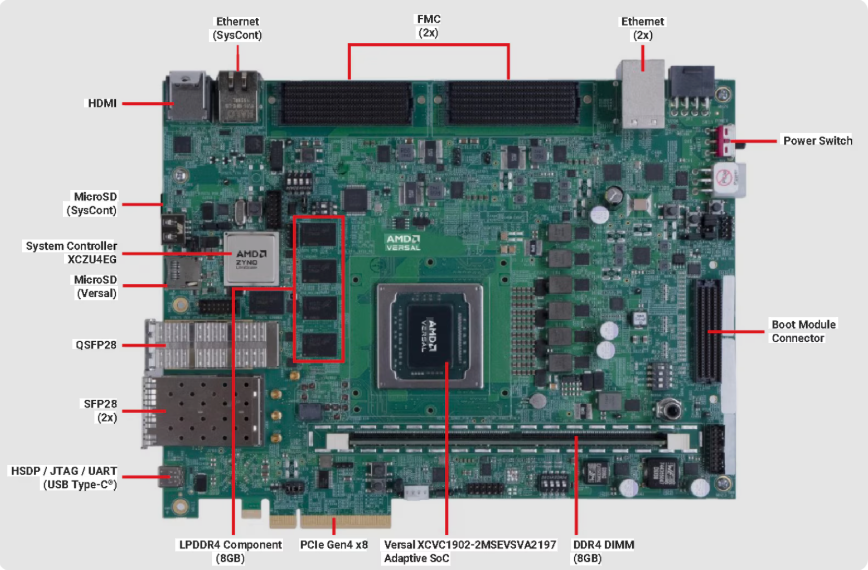
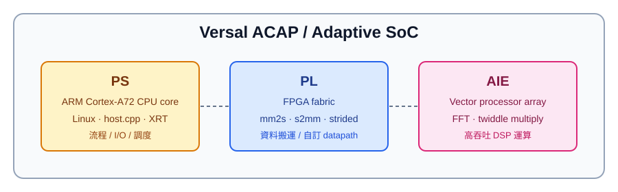
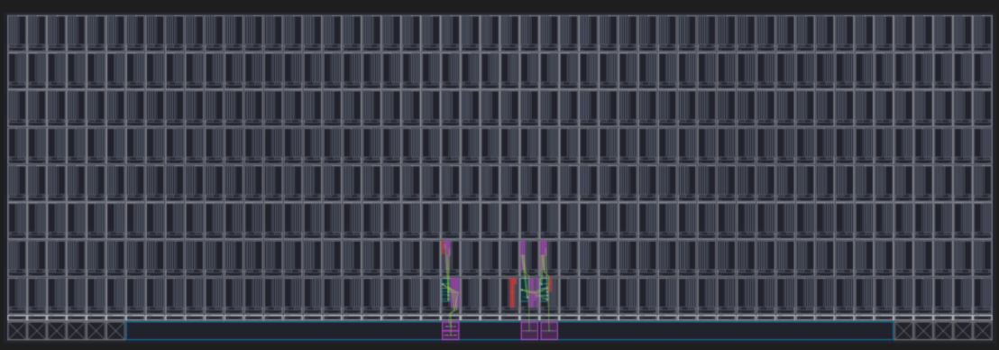
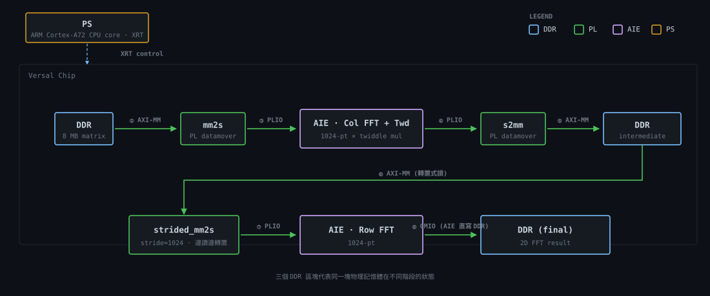

# vitis-rda-versal 專案 High-level 講解

- **時長**：~10 分鐘
- **報告對象**：對 AMD/Xilinx Versal 晶片家族無先備知識之同仁。
- **重點**：
  1. AI Engine 是什麼
  2. AIE 應用案例探討 (以 2D FFT 為例)
  3. PS / PL / AIE 三層分工

## 0. 執行摘要 (Executive Summary)

- **文件目的**：
  本文件旨在快速（約 10 分鐘）建立團隊對 `vitis-rda-versal` 專案的 High-level 認知。重點將解構 AI Engine (AIE) 之運作原理，並釐清處理系統 (PS)、可程式化邏輯 (PL) 與 AIE 間的軟硬體協作機制。

- **內容範疇**：
  本文件之探討核心為 **AI Engine (AIE)** 的運算模型與實務應用。系統中的 PS 與 PL 模組將僅針對其與 AIE 的介面銜接（如資料流控制、記憶體搬運）進行輔助性探討，不展開底層暫存器或韌體細節。

---

## 1. 應用案例先導：為何需要 AI Engine？

AI Engine 具備極強的平行運算能力，非常適合處理高吞吐量的數位訊號處理 (DSP) 與矩陣運算。為了具體展示 AIE 的效能，本專案選擇了一個經典的應用情境：

> **案例情境：在 Xilinx Versal VCK190 上使用 AI Engine 加速 1024 × 1024 二維 FFT**
> 此範例為完整的端到端 (end-to-end) 架構，不僅展示 AIE 的運算力，更示範如何搭配 PL (FPGA) 端的 HLS 模組搬運資料，以及 PS (ARM CPU) 端的 host 程式進行系統排程。

**本章重點**：
> AI Engine 專職加速複雜的數學與訊號處理。在此 2D FFT 案例中，AI Engine 專心負責數學運算、FPGA 負責高效搬移資料、ARM CPU 則在背後指揮大局。

---

## 2. 核心架構解析：Versal ACAP 與 AI Engine

### 2.1 硬體層級定義

為利於快速釐清硬體定義，我們直接從「物理大小（由外到內包覆）」來拆解這幾個名詞：

| 實體層級 | 本專案硬體名詞 | 這是什麼？ |
|---|---|---|
| **開發板** | **VCK190** | 實體的評估板 (Board)，包含電源、風扇與周邊介面，如同電腦主機板。 |
| **SoC 晶片** | **XCVC1902** | 焊在板子上的那顆 SoC 晶片。 *(註：**Versal ACAP** 是這顆晶片的「家族系列統稱」，如同 Intel Core i7 是一個系列名稱)* |
| **晶片內部區塊** | **AI Engine (AIE)** | 晶片內部的三大子系統之一（另有 PS 與 PL）。是由 400 個微型運算單元 (Tiles) 組成的 2D 計算陣列總稱。 |

**Summary**：
> 本專案基於 **VCK190 評估板**進行開發，其核心為 **Versal 架構之 XCVC1902 SoC 晶片**。本報告探討之主體 **AI Engine**，即為內建於該 SoC 之中、由 400 個 Tiles 所構成的高效能平行運算子系統。

---

### 2.2 什麼是 Versal ACAP？

#### **ACAP (Adaptive Compute Acceleration Platform，自適應運算加速平台)**

- ACAP 本質上為一顆 SoC，但因其內部同時整合了 CPU、FPGA 與 AI 陣列三種截然不同的運算資源，AMD/Xilinx 為了突顯其異質運算特性，特別創造了「ACAP」這個名詞來與傳統 SoC 做出區隔。

- 在 AMD/Xilinx 的定義裡，一顆 Versal ACAP 裡面，主要包含三大區塊：

| 晶片內部區塊 | 縮寫 | 內容 | 適合做的事 |
|---|---|---|---|
| **Processing System** | **PS** | ARM Cortex-A72 (Linux runs here) | 控制流程、I/O、調度 |
| **Programmable Logic** | **PL** | 傳統 FPGA fabric | 自定義 datapath、I/O 介面、bit-level operation |
| **AI Engine** | **AIE** | VLIW SIMD vector processor array | 高吞吐、規律性、可向量化的運算 |

---

### 2.3 深入理解 AI Engine

**1. AIE 到底是什麼？**
- 是一個由數百個微型計算單元 (Tiles) 構成的 2D 陣列（在 VCK190 晶片上有 400 個）。
- 本質上更像是一群「極度擅長平行數學運算的微型 DSP，透過晶片內網路互相串接起來的流水線工廠」。

> 這張圖是 AIE compiler / analyzer 看到的 tile array 視角：背景格子代表整片 AIE tile 陣列；彩色區塊與連線代表本設計實際 mapping 到的 kernel tile 與 stream route。換句話說，不是所有 tiles 都被用到，只有被 graph placement / routing 標出的區域參與這個 FFT dataflow。

**2. 適合 vs 不適合做什麼？**
| 適合 | 不適合 |
|---|---|
| FFT / FIR / 矩陣乘法 | 高度控制流程的運算 |
| CNN 推理 (卷積、ReLU) | 不規則記憶體存取 |
| 波束成形 (Beamforming)、雷達訊號處理 | 需要作業系統、系統呼叫 |
| 任何串流 + 向量化的 DSP | 單一且不連續的快速運算 |

**3. AIE 的程式模型**
主要分為兩層概念：
- **Kernel (C++)**：在單一 tile 上執行的計算函式（例如：做一次 1024-pt FFT）。
- **Graph (ADF API)**：將多個 kernel 用資料流 (stream) 連接起來的 Dataflow 拓樸圖。
> *(註：開發完成後，AIE Compiler 會自動將 kernel 映射到實體的 tile、規劃硬體繞線、產出 ELF 執行檔，並處理與 PL/PS 的介面對接。)*

---

## 3. 異質運算架構：PS、PL 與 AIE 的完美分工

> 靜態圖可用於 Markdown 預覽；互動版則嵌入在 `notes.html`，可點擊區塊查看每一步說明。

### 3.1 三層各司其職：以 2D FFT 專案為例

在這個 2D FFT 的案例中，清楚展示了 PS、PL 與 AIE 是如何完美分工的。以下為三層的具體角色與對應的原始碼檔案：

| 層級 | 角色定位 | 主要原始碼檔案 | 本案例具體任務與運作流程 |
|---|---|---|---|
| **PS** (ARM Cortex-A72 CPU core) | **指揮中心** | [sw/host.cpp](../sw/host.cpp) [sw/aie_control_xrt.cpp](../sw/aie_control_xrt.cpp) | **1.** 啟動 Linux 並執行 host 程式。 **2.** 從 SD 卡讀入 8 MB 的測試輸入陣列至 DDR。 **3.** 透過 XRT API 載入 `.xclbin`。 **4.** 啟動 AIE Graph，並在迴圈中觸發 PL 的搬運任務。 **5.** 等待所有 Kernel 算完，將結果存回 SD 卡。 |
| **PL** (FPGA) | **搬運專員** | [hls/mm2s.cpp](../hls/mm2s.cpp) [hls/s2mm.cpp](../hls/s2mm.cpp) [hls/fft_strided...](../hls/fft_strided_mm2s.cpp) | **1. mm2s**：從 DDR 抓取 Column 資料，串流給 AIE。 **2. s2mm**：接住 AIE 算完的 Column 結果，寫回 DDR。 **3. strided_mm2s**：用跳躍式位址「邊讀邊轉置」，串流給 AIE 做 Row FFT。 |
| **AIE** (運算陣列) | **計算引擎** | [aie/graph.cpp](../aie/graph.cpp) [aie/col_fft...](../aie/col_fft_twd_mul_graph.h) [aie/row_fft...](../aie/row_fft_graph.h) | **1. Col 階段**：收串流資料 → 跑 1024-pt FFT → 乘 Twiddle factor → 丟出串流。 **2. Row 階段**：收轉置串流 → 跑 1024-pt FFT → 透過 GMIO 直接寫回 DDR。 *(註：Col 與 Row 佔用不同 Tile，可管線化重疊執行)* |
| **黏合層** (System) | **總接線圖** | [system.cfg](../system.cfg) | 負責宣告「PL 的哪根管子要接到 AIE 的哪個洞」，是異質系統間的連線設定檔。 |

> **一句話速記**：**PS 下命令、PL 搬資料、AIE 算數學**。資料以 DDR 為中心：`DDR → PL → AIE → PL → DDR → PL → AIE → DDR`，最後 PS 再把 DDR 結果寫回 SD card。

---

## 4. 實作拆解：1024x1024 2D FFT 資料流

本案例使用 Cooley-Tukey 演算法，將 2D FFT 拆解為「行處理 (Column)」與「列處理 (Row)」兩個獨立的 AIE Graph。以下為核心實作細節的快速歸納：

| 實作面向 | 關鍵概念與設定 |
|---|---|
| **第一階段：Column FFT**  `col_fft_twd_mul_graph.h` | 收取 PLIO 串流資料，執行 **1024-pt FFT**，隨後乘上 **Twiddle Factor**。計算完畢後經由 PL `s2mm` 寫回 DDR。 |
| **第二階段：Row FFT** `row_fft_graph.h` | 讀取轉置後的串流資料，再次執行 **1024-pt FFT**。計算完畢後，直接透過 **GMIO** 寫回 DDR。 |
| **硬體資源配置** Tile Placement | AIE 為實體的物理陣列，Kernel 擺放位置會直接影響傳輸頻寬。 • Col 階段配置於 Tile `(24, 0)` – `(27, 2)` • Row 階段配置於 Tile `(24, 3)` – `(27, 4)` |
| **編譯期優化參數** `sub_fft_par.h` | 開發者可透過參數微調效能： • `N_BATCH_FFT`：一次處理多筆資料。 • `N_PARAL`：平行展開多條 Pipeline。 |
| **流量橋接設計** Widget Kernels | 當開出多條 Pipeline (`N_PARAL > 1`) 時，需使用橋接 Kernel (`distributer` / `collector`) 處理資料流的分流與合流。 |

> **PLIO vs GMIO 介面比較**：兩者皆為 AIE 的資料傳輸標準。
> - **PLIO**：AIE 與 PL (FPGA) 之間的串流介面，低延遲、適合連續資料傳輸。
> - **GMIO**：AIE 直接讀寫 DDR 記憶體的介面，頻寬大、適合巨量 Block 存取。

---

## 5. 總結與技術心得

> **本專案為「以 AIE 加速 DSP 演算法」的標準範例**。掌握此專案即可理解：
> 1. Versal 三層 (PS / PL / AIE) 怎麼分工
> 2. AIE kernel 跟 graph 的寫法
> 3. PLIO vs GMIO 兩種介面什麼時候用哪個
> 4. Tile placement、parallelism、batching 這些優化旋鈕怎麼轉

---

## 附錄 A：AI Engine 硬體名詞解釋

**AIE 的本質為一個 array of VLIW SIMD vector processors**。以下為相關專有名詞的白話對照表：

| 名詞 | 是什麼 | 比喻 / 備註 |
|---|---|---|
| **CPU** | Central Processing Unit，通用處理器 | 像家裡的管家，什麼都做但一次一件 |
| **PS** | Processing System，Versal 內的處理系統區塊。 | 跑 Linux、執行 host 程式、負責流程控制 / I/O / 調度。 |
| **ARM** | CPU 架構與 IP 設計公司。 | ARM 設計 CPU core，AMD/Xilinx 把 ARM core 整合進 Versal PS。 |
| **ARM Cortex-A72 CPU core** | ARM 公司設計的 64-bit 應用級 CPU 核心。Versal **PS** 運行 Linux 就是用這顆。 | 它不是 PS 的名稱，而是 PS 裡面的 CPU core。 |
| **SIMD** | Single Instruction, Multiple Data — 一條指令同時對多筆資料運算 | 「一聲令下，全班同時做伏地挺身」 |
| **VLIW** | Very Long Instruction Word — 一條指令封裝多個運算 slot 同時下發，靠 compiler 安排併行 | 「一張菜單同時點好幾道菜」 |
| **DSP** | Digital Signal Processor / Processing — 數位訊號處理 | 專門處理數學運算與訊號轉換的技術或硬體 |
| **FFT** | Fast Fourier Transform — 快速傅立葉轉換 | 頻譜分析的核心演算法，本專案的應用主體 |
| **MAC** | Multiply-Accumulate — 乘加運算 | DSP 效能的核心衡量指標，AIE 單一週期可執行大量 MAC |
| **XRT** | Xilinx Runtime，運行在 PS/Linux 上的軟體 API / runtime。 | 讓 `host.cpp` 可以載入 `.xclbin`、建立 DDR buffer、啟動 PL kernel / AIE graph、等待硬體完成。 |
| **HLS** | High-Level Synthesis — 高階合成技術 | 將 C++ 程式碼直接轉譯為 FPGA 硬體電路的技術 |
| **Vector processor** | 把 VLIW + SIMD 結合成的小型處理器，一個 cycle 做大量平行 MAC | 一顆超專業的 DSP |
| **Vector processor array**| 上述 vector processor 複製幾百顆排成 2D grid，相鄰可直接串流通訊 | 一整個工廠流水線 |
| **AIE tile** | array 裡的「一格」= 一顆 vector processor + 周邊（往下展開） | 工廠裡的一個工位 |
| ├ **Vector unit** | tile 內做 SIMD 平行運算的部分，1 cycle 可做多個 MAC | 工位的雙手，一次抓很多顆 |
| ├ **Scalar unit** | tile 內處理 control flow（if / loop / 分支）的部分 | 工位的腦袋，做判斷 |
| ├ **Local memory** | tile 內 32 KB SRAM，極低延遲（單 cycle 存取） | 工位旁邊的小櫃子 |
| ├ **DMA engine** | tile 內負責搬資料到鄰居 tile / PL / DDR 的硬體單元 | 工位的機械搬運手臂 |
| └ **Cascade interface**| 直接把運算結果送隔壁 tile，不經 memory | 工位之間的傳送帶 |
| **mm2s** | Memory-Mapped → Stream | PL 專用詞：指從 DDR (AXI-MM) 讀資料，轉成 AXI-Stream 餵給 AIE |
| **s2mm** | Stream → Memory-Mapped | PL 專用詞：從 AIE 收取 AXI-Stream，轉成 AXI-MM 寫回 DDR |
| **AXI-MM** | AXI Memory-Mapped | 有記憶體位址的隨機存取介面（主要用來接 DDR） |
| **AXI-Stream** | AXI Stream | 無位址的純資料流介面（主要用來接 AIE 或 PL 內部流水線） |
| **datamover** | PL 內的資料搬運 kernel（如 mm2s、s2mm）。 | 負責在 DDR 與 AIE 之間搬運資料，或在 DDR 內做轉置式存取。 |
| **Twiddle factor** | FFT 演算法中用於調整頻率成分的複數係數。 | 在 column FFT 階段乘上 twiddle factor 是 Cooley-Tukey 演算法的標準步驟，幫助完成 2D FFT 的正確計算。 |
| **PLIO** | PL ↔ AIE 的串流介面。 | 用於 PL 與 AIE 之間的資料傳輸，適合連續、低延遲的資料流動。 |
| **GMIO** | AIE ↔ DDR 的介面。 | 讓 AIE 可以直接讀寫 DDR 記憶體，提供高頻寬的資料存取能力。 |
| **strided** | 一種存取模式，指在記憶體中以固定間隔讀寫資料。 | 在本專案中用於從 DDR 讀取轉置後的資料，讓 AIE 可以直接處理 row FFT 的輸入。 |

---

## 附錄 B：專案檔案與資料夾速查

### B.1 關鍵檔案路徑
| 角色 | 路徑 |
|---|---|
| 專案總入口 | [Makefile](../Makefile), [system.cfg](../system.cfg) |
| AIE 頂層 graph 實例化 | [aie/graph.cpp](../aie/graph.cpp) |
| AIE column graph 定義 | [aie/col_fft_twd_mul_graph.h](../aie/col_fft_twd_mul_graph.h) |
| AIE row graph 定義 | [aie/row_fft_graph.h](../aie/row_fft_graph.h) |
| AIE 編譯期參數 | [aie/sub_fft_par.h](../aie/sub_fft_par.h) |
| AIE tile placement | [aie_constraints.json](../aie_constraints.json) |
| PL data movers | [hls/mm2s.cpp](../hls/mm2s.cpp), [hls/s2mm.cpp](../hls/s2mm.cpp), [hls/fft_strided_mm2s.cpp](../hls/fft_strided_mm2s.cpp) |
| PS host 應用 | [sw/host.cpp](../sw/host.cpp), [sw/aie_control_xrt.cpp](../sw/aie_control_xrt.cpp) |
| 結果驗證腳本 | [verify/verify_output.py](../verify/verify_output.py) |

### B.2 資料夾結構
| 資料夾 | 縮寫 / 全名 | 用途 | 編譯自動產生？ |
|---|---|---|---|
| [aie/](../aie/) | AI Engine | AIE graph + kernel C++ 原始碼 | 否（手寫） |
| [hls/](../hls/) | High-Level Synthesis | PL kernel C++ 原始碼，被 `v++` 編成 `.xo` | 否（手寫） |
| [sw/](../sw/) | software | PS 端 host 應用程式（C++） | 否（手寫） |
| [verify/](../verify/) | — | Python 驗證腳本 + 測試資料 `.npy` | 否（大 `.npy` 被 gitignore） |
| [doc/](../doc/) | documentation | 你的筆記 + 圖（這份檔案就在這） | 否（手寫） |
| [imp_result/](../imp_result/) | implementation result | 跑完 build 後的 utilization / timing 報告 | 是（但通常想留著比較） |
| [emu_qemu_scripts/](../emu_qemu_scripts/) | — | QEMU 硬體模擬啟動腳本 | 是 |
| [Work/](../Work/) | — | **AIE compiler** 編譯中間檔（ELF、memmap、routing） | 是 |
| `_x/` | — | **v++** 編譯中間檔（HLS、link 階段暫存） | 是 |
| `_ide/` | — | Vitis IDE 自動產生的 workspace 設定 | 是 |
| [cfg/](../cfg/) | configuration | 工具產生的 metadata | 是 |
| [sim/](../sim/) | simulation | aiesimulator / x86 simulator 輸出 | 是 |
| [sd_card/](../sd_card/) | — | 打包 SD card image 前的暫存區 | 是 |
| `.Xil/` | — | Xilinx 工具的 lock / temp 檔 | 是 |
| `.ipcache/` | — | Vivado IP cache | 是 |

> **快速辨認原則**：開頭有 `.` 或 `_`、或名字是 `Work` / `cfg` / `sim` 的，幾乎都是工具產生的暫存目錄，**刪掉重 build 就會回來**。

### B.3 根目錄產出檔 (Generated Files)
按用途分組。**「可清理」標示為 "Y" 者，代表 `make` 或 `git clean` 會重新產生，可放心刪除**。

#### A. 燒板 / 跑模擬必備的最終產物
| 檔名 | 全名 / 意義 | 是什麼 | 可清理 |
|---|---|---|---|
| `a.xclbin` | Xilinx Compute Library Binary | **最終要燒到板子上的二進位**，包含 PL bitstream + AIE binary + metadata | Y (`make` 會重產) |
| `BOOT.BIN` | Boot Image | Versal 開機 image，把 firmware + bitstream + Linux + rootfs 通通包進來 | Y |
| `host.exe` | — | PS 端 ARM 執行檔，板子 boot 後執行的就是它 | Y |
| `sd_card.img` | — | **4 GB** 完整 SD card 映像檔，QEMU 模擬時掛載；空間吃很大 | Y (最該定期刪) |

#### B. Build 中間產物（流程中經過的階段檔）
| 檔名 | 全名 / 意義 | 是什麼 | 可清理 |
|---|---|---|---|
| `aie_base_graph_hw.xsa` / `_hw_emu.xsa` | eXtensible Shell Archive | `v++ --link` 把 AIE+PL 拼起來的產物，丟給 `--package` 變成 BOOT.BIN | Y |
| `libadf.a` | Adaptive Data Flow library | AIE graph 編譯後的靜態 lib，給 `v++ --link` 用 | Y |
| `plm.bin` | Platform Loader & Manager | Versal 開機第一級 firmware | Y |
| `pmc_cdo.bin` | Configuration Data Object | Versal 開機時配置硬體用的指令序列 | Y |
| `aie.merged.cdo.bin` | AIE Configuration Data Object | 配置 AIE array 用的指令序列 | Y |
| `BOOT_bh.bin` / `boot_image.bif` | Boot Header / Format | 描述 BOOT.BIN 格式與內容的 spec | Y |

#### C. 報告 / Log（可選保留）
| 檔名 | 是什麼 | 可清理 |
|---|---|---|
| `*.log` | 各種工具 build / 模擬 log | Y |
| `*.link_summary` / `*.package_summary` | v++ 各階段摘要報告 | Y |
| `Map_Report.csv` / `sol.db` | HLS / scheduling 報告 | Y |
| `launch_hw_emu.sh` / `qemu_args.txt` 等 | QEMU 模擬啟動腳本與參數 | Y |
| `xilinx_vck190_base_202420_1.wcfg` | Vivado / Vitis 模擬器波形設定 | Y |

#### D. 千萬不要刪（手寫 source）
| 檔名 | 是什麼 |
|---|---|
| [Makefile](../Makefile) | 主控 build 流程 |
| [system.cfg](../system.cfg) | PL ↔ AIE streaming 連線設定 |
| [aie_constraints.json](../aie_constraints.json) | AIE tile placement |
| [README.md](../README.md) | 原專案說明 |
| `.gitignore` | git 忽略清單 |

---

## 附錄 C：編譯流程與清理指南

### C.1 編譯流程 (Makefile Targets)
主控 [Makefile](../Makefile) 的主要 targets：

| 指令 | 在做什麼 | 產物 |
|---|---|---|
| `make aie` | 用 AIE compiler 編 graph | `libadf.a`、`Work/` |
| `make hls` | 把 HLS kernel 編成 `.xo` | `mm2s.xo`、`s2mm.xo` 等 |
| `make xsa` | `v++ --link` 把 AIE + PL 拼起來 | `.xsa` (hardware design archive) |
| `make host` | aarch64 cross-compile | `host.exe` (ARM 執行檔) |
| `make package` | 打包成 SD card image | `BOOT.BIN` + rootfs + xclbin |
| `make aiesim` | 跑 AIE 模擬器 | 驗證 graph 行為 |
| Hardware emulation | QEMU + AIE 模擬 | 驗證整個系統行為 |

> **執行流程**：把 SD card 插到 VCK190 板子 → boot Linux → 跑 `./host.exe` → 結果寫回 DDR → 拷回主機用 `verify_output.py` 驗證。

### C.2 一鍵清理
| 想清什麼 | 指令 |
|---|---|
| 清掉 Makefile 預設認得的中間檔 | `make clean` |
| 把所有 gitignore 列出的東西全清掉（最徹底） | `git clean -fdX` |
| 只查看會被清掉哪些東西、不真的刪 | `git clean -ndX` |

> **注意**：`git clean -fdX` 會把 `.gitignore` 內所有東西都殺掉，包括 `verify/data_rx_1024_complex_64.npy`（測試資料 8 MB），請確保您有備份。

---

## 附錄 D：VCK190 板上模組速查

以下整理自 2.1 節 VCK190 開發板照片中的標示，重點是快速分辨「這個接頭 / 晶片是做什麼用的」。

| 圖中名稱 | 定義 | 主要功能 |
|---|---|---|
| **Versal XCVC1902-2MSEVSVA2197 Adaptive SoC** | 本板的主晶片，屬於 Versal AI Core 系列。 | 承載本專案的 PS / PL / AIE 三層異質運算；AIE 加速 FFT，PL 做資料搬運，PS 跑 Linux host 控制流程。 |
| **DDR4 DIMM (8GB)** | 插槽式 DDR4 系統記憶體。 | 提供 Versal PS / PL / AIE 經由記憶體系統存取的大容量工作區，本專案的輸入、中間結果與輸出都以 DDR 為中心流動。 |
| **LPDDR4 Component (8GB)** | 板上焊接式 LPDDR4 記憶體。 | 提供額外高速記憶體資源，適合需要較高 bandwidth 或額外 buffer 的設計。 |
| **System Controller XCZU4EG** | 板上管理用 Zynq UltraScale+ MPSoC，不是本專案主要運算晶片。 | 負責板級管理，例如電源、時脈、感測、狀態監控、韌體管理與部分設定控制。 |
| **Ethernet (SysCont)** | 連到 System Controller 的乙太網路埠。 | 用於板級管理、遠端監控或 system controller 韌體 / 設定相關操作。 |
| **MicroSD (SysCont)** | 給 System Controller 使用的 microSD 卡槽。 | 存放或更新 system controller 相關啟動映像、韌體或管理資料。 |
| **MicroSD (Versal)** | 給 Versal 主 SoC 使用的 microSD 卡槽。 | 作為 Versal PS 的開機 / 儲存媒體；常放 BOOT.BIN、Linux、rootfs、xclbin、host.exe 與測試資料。 |
| **PCIe Gen4 x8** | PCI Express Gen4、8 lane 高速介面。 | 讓 VCK190 可作為 PCIe endpoint / 加速卡連到主機，適合主機與 Versal 間的高速資料傳輸。 |
| **FMC (2x)** | FPGA Mezzanine Card 擴充連接器，共兩組。 | 外接 ADC / DAC、感測器、射頻板或自訂 I/O mezzanine card，擴充 PL 可接的高速或一般 I/O。 |
| **QSFP28** | Quad Small Form-factor Pluggable 28G 高速光電模組介面。 | 常用於 100G Ethernet 或其他高速 serial link 測試。 |
| **SFP28 (2x)** | Small Form-factor Pluggable 28G 高速光電模組介面，共兩組。 | 常用於 10G / 25G Ethernet 或高速 serial transceiver 測試。 |
| **Ethernet (2x)** | 連到主系統的雙乙太網路埠。 | 提供 Versal 系統一般網路連線，可用於 Linux networking、資料傳輸或應用層通訊。 |
| **HDMI** | 影像輸出 / 輸入相關介面。 | 可用於顯示、影像 pipeline 或 multimedia demo；本 2D FFT 範例通常不會用到。 |
| **HSDP / JTAG / UART (USB Type-C)** | Debug 與主控 console 介面，使用 USB Type-C 實體接頭。 | 用於 JTAG download / debug、UART console、硬體 bring-up 與開發時觀察 PS/Linux 訊息。 |
| **Boot Module Connector** | 可接 boot module 的板上連接器。 | 提供開機模式、設定或板級啟動相關擴充；通常用於開發板 boot / configuration 流程。 |
| **Power Switch** | 開發板電源開關。 | 控制整張 VCK190 開發板上電 / 斷電。 |
